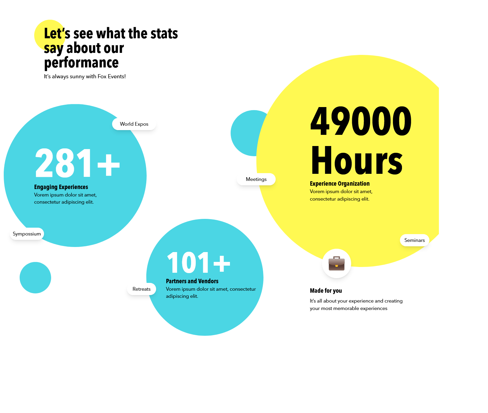

# Build Simple Performance page Design

## Table of contents

- [Overview](#overview)
  - [Screenshot](#screenshot)
  - [Links](#links)
- [My process](#my-process)
  - [Built with](#built-with)
  - [Useful resources](#useful-resources)
- [Author](#author)
- [Acknowledgments](#acknowledgments)

## Overview

This is a simple design I worked on checkout the design on the screenshot below.

### Screenshot

### Links

- Solution URL: [solution URL here](https://github.com/betses/Performance-page)
- Live Site URL: [live site URL Comming Soon](#)

## My process

### Built with

- [Tailwind CSS](https://tailwindcss.com/)
- [React](https://reactjs.org/)

### Useful resources

- [Vite](https://vitejs.dev/guide/) - Vite is a versatile build tool that can be used for several purposes, including faster development, easy setup, hot module replacement, a plugin system for customization, optimized production builds, and support for multiple frameworks such as React. Using Vite to install React proved to be very beneficial for me. I found the pattern to be highly effective and enjoyable to work with, and Vite's features such as hot module replacement and optimized production builds made development faster and more efficient. As such, I plan to continue utilizing Vite in my future projects with React and other frameworks.
   

- [Tailwind on Vite](https://tailwindcss.com/docs/guides/vite) - This is an amazing Documentaion which helped me install tailwind. I'd recommend it to anyone installing tailwind on vite.

## 👥 Author 

> 👤 **Betsegaw Sebsibe**

- GitHub: [@betses](https://github.com/betses)
- Frontend Mentor - [@betses](https://www.frontendmentor.io/profile/betses)
- LinkedIn: [Betsegaw Sebsibe](https://www.linkedin.com/in/betsegaw-sebsibe/)
- Twitter: [@betse_s](https://twitter.com/Betse_s)

## Acknowledgments

[Natnael Demelash](https://github.com/NatiDeme) For letting me work on this task
